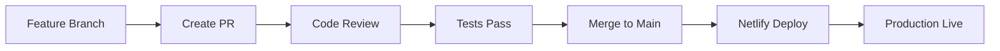

# 🔒 GitHub Workflow & Repository Management

Complete guide for managing your ITSON FSM repository with proper security, branching, and deployment workflows.

---

## 📋 Table of Contents

1. [Repository Privacy](#repository-privacy)
2. [Branch Structure](#branch-structure)
3. [Branch Protection](#branch-protection)
4. [Development Workflow](#development-workflow)
5. [Deployment Strategy](#deployment-strategy)
6. [Team Collaboration](#team-collaboration)
7. [Security Best Practices](#security-best-practices)

---

## 🔒 Repository Privacy

### Make Repository Private

**Option 1: GitHub Web (Mobile-Friendly)**

1. Go to your repository: https://github.com/OkoMac/ITSON-FSM
2. Click **Settings** (gear icon)
3. Scroll down to **Danger Zone**
4. Click **Change repository visibility**
5. Select **Make private**
6. Type repository name to confirm: `ITSON-FSM`
7. Click **I understand, change repository visibility**

**Option 2: GitHub CLI**

```bash
# Set repository to private
gh repo edit OkoMac/ITSON-FSM --visibility private

# Verify
gh repo view OkoMac/ITSON-FSM --json visibility
```

**Option 3: GitHub API**

```bash
curl -X PATCH \
  -H "Authorization: token YOUR_GITHUB_TOKEN" \
  -H "Accept: application/vnd.github.v3+json" \
  https://api.github.com/repos/OkoMac/ITSON-FSM \
  -d '{"private":true}'
```

### Who Can Access Private Repository

- ✅ **Owner** (you) - Full access
- ✅ **Collaborators** - Access levels you set
- ❌ **Public** - No access
- ❌ **Search engines** - Cannot index

---

## 🌿 Branch Structure

### Current Branches

```
main                              # Production-ready code
├── claude/yetomo-pwa-platform-ZaYeQ   # Latest development
├── claude/deploy-updates-ZaYeQ        # Deployment configs
├── claude/main-with-mobile-fixes-ZaYeQ # Mobile optimizations
└── claude/merged-main-ZaYeQ           # Merged features
```

### Recommended Branch Structure

```
main                    # Production (protected)
├── develop            # Integration branch
│   ├── feature/*     # New features
│   ├── bugfix/*      # Bug fixes
│   ├── hotfix/*      # Production hotfixes
│   └── release/*     # Release candidates
└── staging           # Pre-production testing
```

### Branch Naming Convention

| Type | Pattern | Example | Purpose |
|------|---------|---------|---------|
| Feature | `feature/description` | `feature/whatsapp-onboarding` | New features |
| Bug Fix | `bugfix/description` | `bugfix/login-error` | Bug fixes |
| Hotfix | `hotfix/description` | `hotfix/critical-security` | Urgent production fixes |
| Release | `release/version` | `release/v1.0.0` | Release preparation |
| Docs | `docs/description` | `docs/api-guide` | Documentation |

### Clean Up Old Branches

```bash
# List all branches
git branch -a

# Delete local branch
git branch -d claude/old-branch

# Delete remote branch
git push origin --delete claude/old-branch

# Prune deleted remote branches
git remote prune origin
```

---

## 🛡️ Branch Protection

### Protect Main Branch

**GitHub Web:**

1. Go to **Settings** → **Branches**
2. Click **Add rule** under "Branch protection rules"
3. Branch name pattern: `main`
4. Enable these protections:

#### Required Settings

- ✅ **Require a pull request before merging**
  - ✅ Require approvals: 1
  - ✅ Dismiss stale pull request approvals when new commits are pushed

- ✅ **Require status checks to pass before merging**
  - ✅ Require branches to be up to date before merging
  - Add status checks: `build`, `test`, `lint`

- ✅ **Require conversation resolution before merging**

- ✅ **Require signed commits** (optional but recommended)

- ✅ **Include administrators** (enforce rules on admins too)

- ✅ **Restrict who can push to matching branches**
  - Add allowed actors: Your username

- ✅ **Allow force pushes: Never**

- ✅ **Allow deletions: Never**

5. Click **Create** or **Save changes**

### Protect Develop Branch (If Using)

Same as main, but:
- Approvals required: 0 or 1 (less strict)
- Allow force pushes: No
- Allow deletions: No

---

## 🔄 Development Workflow

### Simple Workflow (Solo Developer)

```bash
# 1. Start from main
git checkout main
git pull origin main

# 2. Create feature branch
git checkout -b feature/my-feature

# 3. Make changes and commit
git add .
git commit -m "feat: Add my feature"

# 4. Push to GitHub
git push origin feature/my-feature

# 5. Create Pull Request on GitHub
# - Go to repository on GitHub
# - Click "Compare & pull request"
# - Add description
# - Click "Create pull request"

# 6. Merge PR (if approved)
# - Click "Merge pull request" on GitHub
# - Delete feature branch

# 7. Update local main
git checkout main
git pull origin main
git branch -d feature/my-feature
```

### Team Workflow (Multiple Developers)

```bash
# Developer A: Creates feature
git checkout -b feature/user-authentication
# ... make changes ...
git push origin feature/user-authentication
# Create PR on GitHub

# Developer B: Reviews PR
# - Go to PR on GitHub
# - Review code changes
# - Add comments or approve
# - Merge when ready

# Both: Update local repository
git checkout main
git pull origin main
```

### Hotfix Workflow (Production Bug)

```bash
# 1. Create hotfix from main
git checkout main
git pull origin main
git checkout -b hotfix/critical-bug

# 2. Fix bug and test
# ... fix bug ...
git add .
git commit -m "hotfix: Fix critical bug"

# 3. Push and create PR
git push origin hotfix/critical-bug
# Create PR to main

# 4. After merge, tag release
git checkout main
git pull origin main
git tag -a v1.0.1 -m "Hotfix: Critical bug fix"
git push origin v1.0.1
```

---

## 🚀 Deployment Strategy

### Branch → Environment Mapping

| Branch | Environment | URL | Auto-Deploy |
|--------|-------------|-----|-------------|
| `main` | Production | `https://itsonfsm.com` | ✅ Yes |
| `develop` | Staging | `https://staging.itsonfsm.com` | ✅ Yes |
| `feature/*` | Preview | `https://preview-*.netlify.app` | ✅ Yes |

### Production Deployment Process



#### Steps:

1. **Develop** on feature branch
2. **Test** locally
3. **Create PR** to main
4. **Review** code changes
5. **Merge** to main
6. **Netlify** auto-deploys
7. **Verify** production

### Netlify Deployment Configuration

**Auto-Deploy Settings:**

- **Production branch:** `main`
- **Deploy previews:** All pull requests
- **Branch deploys:** All branches (optional)

**Build Settings:**

```toml
# netlify.toml
[build]
  command = "npm run build"
  publish = "dist"

[context.production]
  environment = { VITE_API_URL = "https://api.itsonfsm.com/api" }

[context.deploy-preview]
  environment = { VITE_API_URL = "https://api-staging.itsonfsm.com/api" }
```

---

## 👥 Team Collaboration

### Add Collaborators

**GitHub Web:**

1. Go to **Settings** → **Collaborators**
2. Click **Add people**
3. Enter GitHub username or email
4. Select permission level:
   - **Read:** View code only
   - **Write:** Push and create PRs
   - **Admin:** Full access
5. Click **Add [name] to this repository**

### Set Up Teams (Organization Only)

If using GitHub Organization:

1. Go to **Organization Settings** → **Teams**
2. Click **New team**
3. Name: `Frontend Developers`, `Backend Developers`, etc.
4. Add team members
5. Set repository access levels

### Code Review Guidelines

**For Reviewers:**

- ✅ Check code quality and standards
- ✅ Test functionality locally
- ✅ Verify no breaking changes
- ✅ Review security implications
- ✅ Check mobile responsiveness
- ✅ Ensure tests pass

**For Authors:**

- ✅ Write clear PR description
- ✅ Link related issues
- ✅ Add screenshots (if UI changes)
- ✅ Ensure tests pass
- ✅ Keep PRs small and focused
- ✅ Respond to review comments

---

## 🔐 Security Best Practices

### 1. Never Commit Secrets

**Files to ALWAYS ignore:**

```gitignore
# Environment variables
.env
.env.local
.env.production
.env.development

# API keys
**/secrets.json
**/credentials.json
**/.credentials

# Certificates
*.pem
*.key
*.cert

# Database
*.db
*.sqlite

# Logs
logs/
*.log
```

**Check before commit:**

```bash
# Scan for potential secrets
git diff --staged | grep -i "api_key\|secret\|password\|token"

# Use git-secrets tool
git secrets --scan
```

### 2. Use Environment Variables

**Good:**

```typescript
const apiKey = import.meta.env.VITE_ANTHROPIC_API_KEY;
```

**Bad:**

```typescript
const apiKey = "sk-ant-api03-xxxxx"; // NEVER do this!
```

### 3. Enable Security Features

**Dependabot:**

1. Go to **Settings** → **Security & analysis**
2. Enable **Dependabot alerts**
3. Enable **Dependabot security updates**
4. Review and merge dependency updates

**Code Scanning:**

1. Go to **Security** → **Code scanning**
2. Click **Set up code scanning**
3. Choose **CodeQL Analysis**
4. Commit the workflow file

### 4. Review Permissions

**Audit access regularly:**

```bash
# View collaborators
gh api /repos/OkoMac/ITSON-FSM/collaborators

# View repository settings
gh repo view OkoMac/ITSON-FSM --json \
  visibility,isPrivate,isArchived
```

### 5. Use SSH Keys

**Set up SSH for Git:**

```bash
# Generate SSH key
ssh-keygen -t ed25519 -C "your_email@example.com"

# Add to SSH agent
eval "$(ssh-agent -s)"
ssh-add ~/.ssh/id_ed25519

# Add to GitHub
cat ~/.ssh/id_ed25519.pub
# Copy and paste to GitHub Settings → SSH Keys

# Test connection
ssh -T git@github.com

# Update remote to use SSH
git remote set-url origin git@github.com:OkoMac/ITSON-FSM.git
```

---

## 📝 Commit Message Guidelines

### Format

```
<type>(<scope>): <subject>

<body>

<footer>
```

### Types

| Type | Description | Example |
|------|-------------|---------|
| `feat` | New feature | `feat(auth): Add biometric login` |
| `fix` | Bug fix | `fix(api): Resolve CORS error` |
| `docs` | Documentation | `docs(readme): Update setup instructions` |
| `style` | Code style | `style(css): Fix indentation` |
| `refactor` | Code refactoring | `refactor(hooks): Simplify useTasks` |
| `perf` | Performance | `perf(images): Add lazy loading` |
| `test` | Tests | `test(auth): Add login tests` |
| `chore` | Maintenance | `chore(deps): Update dependencies` |
| `ci` | CI/CD | `ci(netlify): Add build config` |

### Examples

```bash
# Good commits
git commit -m "feat(whatsapp): Add 14-stage onboarding flow"
git commit -m "fix(mobile): Resolve safe area inset issues on iPhone"
git commit -m "docs(deployment): Add Netlify deployment guide"

# Bad commits (avoid these)
git commit -m "updates"
git commit -m "fixed stuff"
git commit -m "WIP"
```

---

## 🔄 Syncing Forks (If Applicable)

```bash
# Add upstream remote
git remote add upstream https://github.com/original/repo.git

# Fetch upstream changes
git fetch upstream

# Merge upstream main into your main
git checkout main
git merge upstream/main

# Push to your fork
git push origin main
```

---

## 📊 Repository Insights

### View Activity

**GitHub Web:**

- **Insights** → **Pulse** - Recent activity
- **Insights** → **Contributors** - Contribution graph
- **Insights** → **Traffic** - Views and clones
- **Insights** → **Network** - Branch graph

### Generate Reports

```bash
# Commit activity
git log --oneline --graph --all --since="1 month ago"

# Contributors
git shortlog -sn --all

# Changed files
git log --stat --since="1 week ago"
```

---

## 🎯 Quick Reference

### Common Commands

```bash
# Start new feature
git checkout -b feature/my-feature

# Save work in progress
git stash
git stash pop

# Undo last commit (keep changes)
git reset --soft HEAD~1

# View branch differences
git diff main..feature/my-feature

# Sync with remote
git fetch origin
git pull origin main

# Clean up
git remote prune origin
git branch -d old-branch
git push origin --delete old-branch
```

### Repository URLs

- **HTTPS:** `https://github.com/OkoMac/ITSON-FSM.git`
- **SSH:** `git@github.com:OkoMac/ITSON-FSM.git`
- **GitHub CLI:** `gh repo clone OkoMac/ITSON-FSM`

---

## ✅ Security Checklist

- [ ] Repository is private
- [ ] Main branch is protected
- [ ] No secrets in code
- [ ] `.gitignore` configured
- [ ] Dependabot enabled
- [ ] SSH keys set up
- [ ] 2FA enabled on GitHub account
- [ ] Regular security audits
- [ ] Code scanning enabled
- [ ] Collaborator access reviewed

---

## 🚀 Next Steps

1. **Make repository private** (if not already)
2. **Set up branch protection** on main
3. **Configure Netlify** for auto-deployment
4. **Add collaborators** (if team project)
5. **Enable security features** (Dependabot, code scanning)
6. **Document your workflow** in README
7. **Set up CI/CD** (GitHub Actions)

---

## 📞 Support Resources

- **GitHub Docs:** https://docs.github.com
- **GitHub Support:** https://support.github.com
- **Git Book:** https://git-scm.com/book
- **Netlify + GitHub:** https://docs.netlify.com/git/overview/

---

**Session:** https://claude.ai/code/session_2f89178d-02af-4820-a065-4247730bb6de

**Status:** 🟢 Ready for Production
